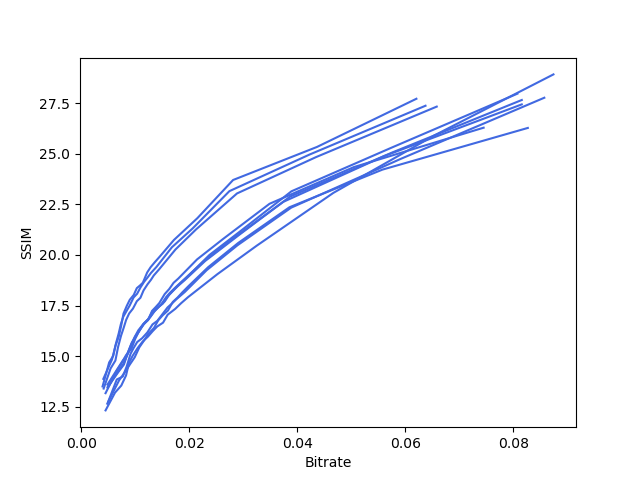

# webp-rdplot

## Prerequisites
- [libwebp](https://github.com/webmproject/libwebp)
- [matplotlib](https://matplotlib.org/)
- [Pillow](https://pillow.readthedocs.io/en/stable/)

## Usage

### Display the RD curve for a single image
```$ python psnr.py filename [psnr/ssim]```

### Display RD curves for a directory containing images
```$ python multi.py directory [psnr/ssim]```

## Example

### `psnr.py`


### `multi.py`

