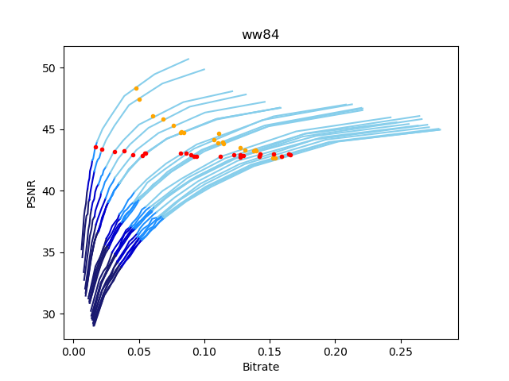

# webp-rdplot

## Prerequisites
- [libwebp](https://github.com/webmproject/libwebp)
- [matplotlib](https://matplotlib.org/)
- [Pillow](https://pillow.readthedocs.io/en/stable/)

## Usage

### Display the RD curve for a single image
`$ python psnr.py filename [{psnr/ssim}]`

### Display RD curves for all images in a directory.
`$ python multi.py [-h] [-s] [-q QUALITY] [-mq] directory`
```
positional arguments:
  directory             directory containing images

optional arguments:
  -h, --help            show this help message and exit
  -s, --ssim            use SSIM instead of PSNR
  -q QUALITY, --quality QUALITY
                        plot points of fixed quality
  -mq, --multi_quality  enable plotting points of varied quality values
```

## Extras

* ### `get_frames.py`:   Extracts frames from Youtube videos.
  **Requirements**: numpy, pytube3, moviepy

  `$ python get_frames.py [-h] [-r RES] [-s START] [-d DURATION] [-f FPS] [-y] url title`

  ```
  positional arguments:
    url                   video URL
    title                 custom video title

  optional arguments:
    -h, --help            show this help message and exit
    -r RES, --res RES     video resolution
    -s START, --start START
                          starting timestamp of the video extract
    -d DURATION, --duration DURATION
                          duration of the video extract
    -f FPS, --fps FPS     frames per second
    -y, --yt_duration     enable adjusting timestamps to fit a 3-second duration
  ```

  **Example:** 
  `$ python get_frames.py -s 138 -d 6 -f 4 -y https://youtu.be/C6kn6nXMWF0 sample`


## Example

### `psnr.py`


### `multi.py`

